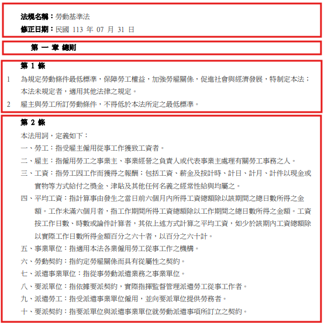

# Homework 2 - LangChain & Document Parsing

## 前言

* 在前一個作業中，你已經學會使用提示(Prompt)來跟LLM溝通。
* 接下來我們要來看看怎麼蒐集跟處理外部資料。
* 在RAG(Retrieval-Augmented Generation)應用中，如何將外部資料切成適當大小的片段是重要的一個環節。
* 在本次作業中，你將了解使用不同的分割策略(text splitter)來解析文本內容所產生的差異。

## 作業規範

* 請使用 **LangChain**, **PyPDF** 套件完成這次作業。
* 請於 **`student_assignment.py`** 中，實作裡面的兩個方法
    * `hw02_1(q1_pdf)`
    * `hw02_2(q2_pdf)`

---

### 第一題：熟悉如何從外部文件來源取得內容，並透過文本分割工具進行解析。

* **說明**：將範例文件的內容切分成適當大小的的單元(chunk)
* **文本**：你手邊有一份範例 PDF 文件 **`OpenSourceLicenses.pdf`**，內容是開源碼授權的基本介紹。
* **任務**：
  1. 請實作方法 `hw02_1(q1_pdf)` 來完成這個任務。
  2. 使用 **PyPDFLoader** 套件的load()方法讀取 **`OpenSourceLicenses.pdf`** 的文本內容。
  3. 使用 **CharacterTextSplitter** 將文本以`頁`為單位，分割為多個chunks。
* **提示**：
  1. 可以用 **split_text** 或是 **split_documents** 得到分割後的chunk。
  2. 注意 **CharacterTextSplitter** 的參數配置：
      - chunk_overlap=0
      - schunk_size, separator 可以用預設值，也可以自行調整
* **預期輸出**：
  - 請回傳最後一個chunk物件，裡面預期會包含檔名、頁數跟內文

---

### 第二題：探索不同文本分割策略對產生的資料切片的差異

* **說明**：在第一題中，我們給的文本剛好適合用一頁一頁來切分，那如果文本內容有跨頁的情況又該怎麼切分比較好呢？
* **文本**：請使用另外一份範例 PDF 文件 **`勞動基準法.pdf`**，內容是勞基法的相關法條。
* **任務**：
  1. 使用 **PyPDFLoader** 套件的load()方法讀取 **`勞動基準法.pdf`** 的文本內容。
  2. 使用 **RecursiveCharacterTextSplitter** 將文本分割為多個chunks。
  3. 請試著將`每一章，每一條`切分成單獨的一個個chunk
  4. 第一章以上的部分請試著切成單獨一個chunk
* **提示**：
  1. 請實作方法 `hw02_2(q2_pdf)`，用於完成這個任務。
  2. 系統會用另外一份相似結構的文件來驗證你的方法。
  3. 可以用 **split_text** 或是 **split_documents** 得到分割後的chunk。
  4. 注意 **RecursiveCharacterTextSplitter** 的配置參數：
      - chunk_overlap=0
      - chunk_size, separator 等可以自行嘗試調整
      - regular expression 是你的好幫手
* **預期輸出**：
  - 請回傳得到的`chunks數量`，預期會是一個整數物件
* **切分範例**：
  - 以"勞動基準法"第一頁為例，預期會是這樣切分
  - 
  - "勞動基準法"切分後預期會有111個chunks

---

## 參考來源
- [第一題](https://python.langchain.com/api_reference/text_splitters/character/langchain_text_splitters.character.CharacterTextSplitter.html)
- [第二題](https://python.langchain.com/api_reference/text_splitters/character/langchain_text_splitters.character.RecursiveCharacterTextSplitter.html)
